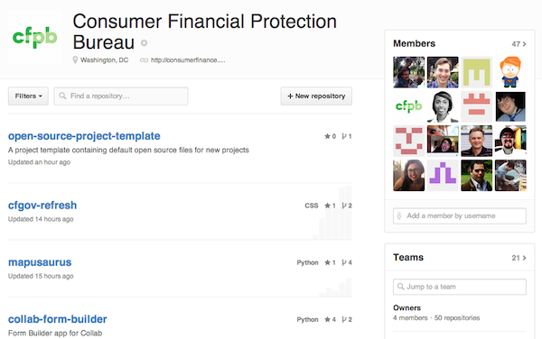

# Cfpb ui animation workshop

A workshop covering the ins-and-outs of UI animation.



## Dependencies

- [Gulp](http://gulpjs.com): task runner for pulling in assets,
  linting and concatenating code, etc.
- [Bower](http://bower.io): Package manager for front-end dependencies.
- [Less](http://lesscss.org): CSS pre-processor.
- [Capital Framework](https://cfpb.github.io/capital-framework/getting-started):
  User interface pattern-library produced by the CFPB.

**NOTE:** If you're new to Capital Framework, we encourage you to
[start here](https://cfpb.github.io/capital-framework/getting-started).

## Installation

1. Install [Node.js](http://nodejs.org) however you'd like.
2. Install [Gulp](http://gulpjs.com), [Bower](http://bower.io), and [HTTP-Server](https://github.com/indexzero/http-server) globally:
  ```bash
  npm install -g gulp bower http-server
  ```
3. Next, install the dependencies and compile the project with:
  ```bash
  ./setup.sh
  ```
  __NOTE:__ To re-install and rebuild all the site’s assets run
  `./setup.sh` again. See the [usage](#usage) section on updating all the
  project dependencies.


## Usage

Each time you fetch from the upstream repository (this repo), run `./setup.sh`.
This setup script will remove and re-install the project dependencies and
rebuild the site's JavaScript and CSS assets.

To start a server to view you changes locally run:

```bash
./runserver.sh
```

To watch for changes in the source code and automatically update the running site,
open a terminal and run:

```bash
gulp watch
```

To edit the page for your animations visit:

- __html:__ `/src/index.html`
- __css:__ `/src/static/css/animations.less`
- __js:__ `/src/static/js/animations.js`

## Known issues

None yet, but it's still early...

## Getting help

Use the issue tracker to follow the development conversation.
If you find a bug not listed in the issue tracker, please file a bug report.

## Getting involved

We welcome your feedback and contributions. See the
[contribution guidelines](https://github.com/cfpb/open-source-project-template/blob/master/CONTRIBUTING.md)
for more details.

Additionally, you may want to consider
[contributing to the Capital Framework](https://cfpb.github.io/capital-framework/contributing/),
which is the front-end pattern library used in this project.


----

## Open source licensing info
1. [TERMS](TERMS.md)
2. [LICENSE](LICENSE)
3. [CFPB Source Code Policy](https://github.com/cfpb/source-code-policy/)


----

## Credits and references

...
